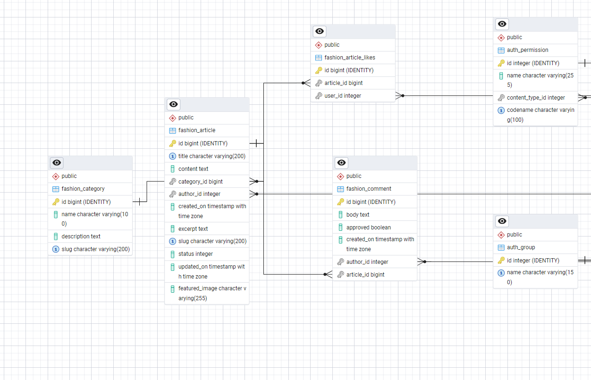

# Little Couture Fashion Blog

## Problem Statement
The goal of this project is to create a fashion blog for kids, where parents and fashion enthusiasts can find the latest trends, styles, and inspirations in children's fashion. The blog will feature articles, events, and other content related to kids' fashion.

## Project Overview
The Little Couture Fashion Blog is a comprehensive platform designed to provide parents and fashion enthusiasts with the latest trends, styles, and inspirations in children's fashion. The blog features a variety of content, including articles, events, and other resources related to kids' fashion. The platform aims to create a community where users can share their experiences, insights, and ideas about children's fashion.

## Project Live Site
You can visit the live site at: [Little Couture Fashion Blog](https://little-couture-3d7dd4f24a83.herokuapp.com/lifestyle/)

## Project Board
The project board is used to track the progress of the project, including tasks, issues, and milestones. You can view the project board at: [Little Couture Project Board](https://github.com/users/AnishAzharudeen/projects/13)

## Responsive
The Little Couture Fashion Blog is designed to be fully responsive, ensuring a seamless user experience across all devices, including desktops, tablets, and smartphones. The responsive design ensures that the blog's layout, images, and content adjust gracefully to different screen sizes and orientations.

## Core Features

Blog Management

- ✔️**Responsive Design**: The blog is designed to be fully responsive, ensuring a seamless user experience across all devices, including desktops, tablets, and smartphones.

- ✔️ **Create Article**: The blog lets the Registered users to Creat,Update,Edit,Delete Article (CRUD)

- ✔️ **Comment and Like the Article**: The blog lets the Logged in users to Creat,Update,Edit,Delete AComment and like /dislike the Article

- ✔️ **Categories and Tags**: Posts are organized using categories and tags, making it easy for users to navigate and find relevant content.
- ✔️ **Events Section**: The blog features an events section that provides information about upcoming events related to children's fashion.
- ✔️ **About Page**: An "About" page provides information about the blog, and allow Registered users to collobrate

User Interaction

- ✔️ **User Interaction**: Users can register, log in, and log out. Authenticated users can create, edit, and delete their own posts, as well as comment on posts.

- ✔️ Mobile & Desktop Optimisation – A fully responsive layout for all devices.

Admin & Moderation Tools

- ✔️   Admin Panel – Manage Blogs Post, users, comments and collobrate request from users efficiently.

- ✔️  Content Review System – Ensure recipe quality and prevent spam.

✨ And more exciting features coming soon! Stay tuned! 🚀

### Acceptance Criteria
The acceptance criteria define the conditions that must be met for the project to be considered complete and successful. The criteria include:
- The blog must be responsive and accessible on all devices.
- Users must be able to view, create, edit, and delete posts.
- Users must be able to register, log in, and log out.
- The blog must include categories and tags for organizing postsin the Admin panel.
- Users must be able to do CRUD operation in the comment section.
- The blog must include an events section with upcoming events.
- The blog must have an "About" page with information about the blog.

## User Design
The user design focuses on creating an intuitive and visually appealing interface for the blog. The design includes a clean layout, easy navigation, and responsive design to ensure a great user experience on all devices.

## WIREFRAMES
The initial wireframes and mockups for the project were created using Balsamiq. These designs helped to visualize the layout and structure of the blog before development began. 

### Admin panel Database

The database for Yummy Tummy is designed to efficiently manage and store user data, recipes, comments, and ratings. It uses PostgreSQL, a powerful, open-source relational database system, which ensures data integrity and supports complex queries.

## Database
I used Code Institute's PostgreSQL database.

## Database Planning
The database for the Little Couture Fashion Blog is designed to efficiently manage and organize the various types of content and user interactions on the platform. The primary models include:

### User
- **Fields**: `username`, `email`, `password`, `is_staff`, `is_active`
- **Description**: Represents a user of the blog, including both regular users and staff members.

### FashionItem
- **Fields**: `title`, `description`, `image`, `category`, `author`, `status`, `created_at`
- **Description**: Represents an article or post on the blog. Each post is associated with a category and an author.

### Category
- **Fields**: `name`, `slug`
- **Description**: Represents a category for organizing posts. Each category has a unique name and slug.

### Comment
- **Fields**: `post`, `author`, `content`, `created_at`, `approved`
- **Description**: Represents a comment made by a user on a post. Comments must be approved by a staff member before they are visible.

### Like
- **Fields**: `post`, `user`
- **Description**: Represents a like made by a user on a post.

### CollaborationRequest
- **Fields**: `user`, `message`, `status`, `created_at`
- **Description**: Represents a request made by a user to collaborate on the blog. Requests must be approved by a staff member.

### Event
- **Fields**: `title`, `description`, `date`, `location`, `created_at`
- **Description**: Represents an event related to children's fashion. Events are displayed in the events section of the blog.

### Data Relationships
- A `User` can create multiple `FashionItem` posts.
- A `FashionItem` post belongs to one `Category`.
- A `FashionItem` post can have multiple `Comment`s.
- A `Comment` is made by a `User` and belongs to a `FashionItem` post.
- A `User` can submit multiple `CollaborationRequest`s.
- A `User` can like multiple `FashionItem` posts.

## Features of this Blog

- **Home Page** 

- **Fashion Page**

- **LifeStyle Page**

- **Submissions Page**

## Testing and Validation
Testing and validation are crucial to ensure the blog functions correctly and provides a great user experience. The following testing methods were used:

- Please see [TESTING.md](Testing.md) file for all testing.

## Version Control & Secure Code Management

This project utilizes Git for version control and is hosted on GitHub. The repository can be accessed here:

📌 [GitHub Repository](https://github.com/gerasoa/MyRecipeBook)

🛠️ Git Workflow

✅ Feature-Based Commits: Commits are made after implementing new features, bug fixes, or complex adjustments.

✅ Main Branch Usage: The project is maintained on the main branch for stability.

✅ Descriptive Commit Messages: Each commit follows a meaningful and structured format.

✅ Secure Code Management

✅ No sensitive data is committed: Credentials and private keys are stored securely.

✅ .env and .gitignore: Used to prevent sensitive files from being included in the repository.

✅ Security Review: The repository is regularly checked to ensure compliance with best security practices.

## Deployment

The application is deployed on Heroku and is accessible at:

### 🛠 Deployment Process

1. Click 'New' > 'Create new app'
2. Choose a unique name, choose your region and press 'Create app'
3. Click on 'Settings' and then 'Reveal Config Vars'
4. Add a key of 'DISABLE_COLLECTSTATIC' with a value of '1'.
5. Add a key of 'DATABASE_URL' - the value will be the URL you were emailed when creating your database.
6. Add a key of 'SECRET_KEY' - the value will be any random secret key (google 'secret key generator' and use it to generate a random string of numbers, letters and characters)
7. In your terminal, type the code you will need to install project requirements:
    - pip3 install gunicorn~=20.1
    - pip3 install -r requirements.txt
    - pip3 freeze --local > requirements.txt
8. Create an 'env.py' file at the root directory which contains the following:
    - import os
    - os.environ["DATABASE_URL"]='CI database URL'
    - os.environ["SECRET_KEY"]=" Your secret key"
9. Create a file at the root directory called Procfile. In this file enter: "web: gunicorn my_project.wsgi" (without the quotes)
10. In settings.py, set DEBUG to False. 
    - YOU SHOULD ALWAYS SET DEBUG TO FALSE BEFORE DEPLOYING FOR SECURITY
11. Add ",'.herokuapp.com' " (without the double quotes) to the ALLOWED_HOSTS list in settings.py
12. Add, commit and push your code.
13. Go back to Heroku, click on the 'Deploy' tab.
14. Connect your project to GitHub.
15. Scroll to the bottom and click 'Deploy Branch' and your project will be deployed!

*************Used  CLOUDINARY_URL – For media storage **********

## 🔒 Security Measures

✔ `SECRET_KEY` and other sensitive credentials are stored securely as environment variables.

✔ `.gitignore` is configured to exclude sensitive files.

✔ `DEBUG = False` in production to enhance security.

## ✅ Deployment Verification

After deployment, the application was tested to ensure:

- The functionality matches the local development version.

- Database connections and media storage work correctly.

- The UI and interactive features operate as expected.

## AI Assistance in Development 🤖

During the development of this project, I strategically used GitHub Copilot to assist in various aspects of the code creation process. Here’s how AI contributed:

1 - Code Creation & Refinement:

Copilot helped generate parts of the code, especially in complex areas, and suggested improvements for better code structure and readability. It also assisted in refining classes and optimizing the CSS for better organization.

Bug Detection & Fixing:

2 -  I encountered several bugs in the code, which were identified and corrected with the help of AI. Copilot played a crucial role in pinpointing semantic errors and suggesting corrections, ensuring smoother functionality.

3 - Content Creation & Testing:

AI also contributed to generating content for the site and testing core functionalities. This was particularly valuable in ensuring that key features were working as expected.

4 - Productivity & Efficiency Gains:

The use of AI drastically reduced development time, allowing for quicker debugging, content generation, and code optimization. The overall impact on productivity was significant, and I was able to focus on higher-level tasks with improved efficiency.

## TECHNOLOGIES USED

**HTML5**: The standard markup language for creating web pages, providing the structure and content of the site.

**CSS3**: A style sheet language used for describing the presentation of a document written in HTML, enabling responsive and visually appealing designs.

**JavaScript**: A programming language that enables interactive web pages, enhancing user experience with dynamic content and features.

**GitHub**: A platform for version control and collaboration, allowing multiple developers to work on projects simultaneously and manage code changes.

**Heroku**: A cloud platform as a service (PaaS) supporting several programming languages, used for deploying, managing, and scaling web applications.

**Pexels**: A free stock photo and video website, providing high-quality images used within the application for visual enhancement.

**Cloudinary**: Media management service that allows uploading, storing, manipulating, and delivering images and videos.

**Crispy-bootstrap5**: Django package that integrates Django forms with Bootstrap 5, allowing for easy and consistent form rendering.

**Dj-database-url**: Utility for configuring database URLs in Django.

**Dj3-cloudinary-storage**: Django package that integrates Django media storage with the Cloudinary service.

**Django**: High-level web framework for Python that enables rapid and clean development of web applications.

**Django-crispy-forms**: Django package that makes it easy to create elegant and reusable forms.

**Django-allauth**: Django application for authentication, registration, and account management.

**Django-summernote**: WYSIWYG editor based on Summernote for integration with Django.

**Gunicorn**: WSGI HTTP server for Python applications, used to deploy Django applications.

**Pillow**: Image processing library for Python.

**Psycopg2**: PostgreSQL database adapter for Python.

**Python3-openid**: Library for supporting the OpenID protocol.

**Tzdata**: Time zone database.

**Whitenoise**: Library for serving static files in Django applications.

## Credit and Acknowledgements

### Resources
 
- **Coolors**: For generating the color palette used in the application.
- **Am I Responsive**: For testing the responsiveness of the application across different devices.
- **Google Fonts**: For providing the fonts used in the application.
- **Logo Design**: Created using Canva to reflect the essence of the application.
- **pgAdmin**: For creating the Entity Relationship Diagram (ERD) used in database planning.
- **Balsamiq**: For wireframe creation.
- **Django**: For Developing Python Framework.
- **Heroku**: For hosting the application.
- **PostgreSQL**: For database management.
- **Copilot & Chatgpt**: For providing high-quality images used in the application
- **Font Awesome**: For icons used throughout the site.
- **CI LMS**: For code related to sign-in, sign-out, register. I have used CI walkthrough project 'I think therefore I blog' for the support during the process. I customised the models, views and templates to create my own unique website.
- **Bootstrap**: HTML & CSS uses [Bootstrap Version 5.3](https://getbootstrap.com/docs/5.3/getting-started/introduction/)

### Tools

- **Visual Studio Code**: For code editing and development.
- **Git and GitHub**: For version control and repository management.

### Inspiration

This project was inspired by Juniorstyle Blog team. Special thanks to the authors.

- **Code Institute**-: For providing the Full Stack Development Bootcamp course and resources that guided the development of this project.
Mentors and Tutors: Special thanks to my faciliator **Emmma Lamont** and tutors - **Spencer** and **Roo** for their invaluable guidance and support throughout the project.
Family and Friends: For their encouragement and feedback, which helped shape the final product.
Open Source Community: For the various libraries and frameworks that made this project possible, including Django, Bootstrap, and PostgreSQL.
GitHub Copilot: For assisting in code suggestions, debugging, and documentation, significantly enhancing productivity and code quality.
To everyone who tested the application and provided constructive feedback, helping to improve the overall user experience and functionality.
