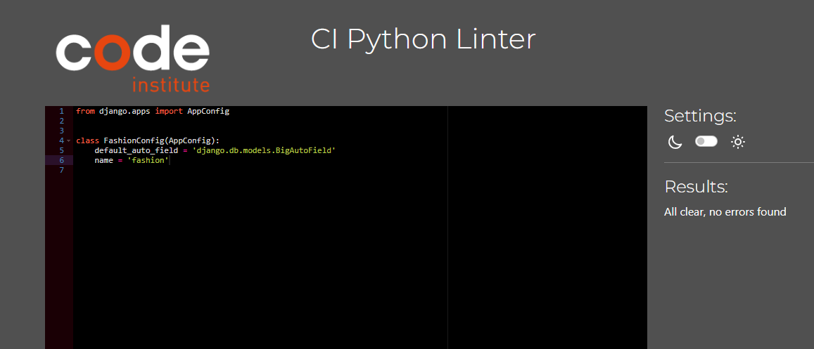

# Testing

- Manual testing was carried out throughout the development of the website and bugs fixed as they arose. 

## Manual testing

| Feature         | TestcaseName                                                          | TestcaseSteps                                                         | TestcaseExpectation                                                                                       | Priority | Result |
| --------------- | --------------------------------------------------------------------- | --------------------------------------------------------------------- | --------------------------------------------------------------------------------------------------------- | -------- | ------ |
| Homepage        | Verify if the page is responsive                                      | Verify if the page is responsive                                      | Check the website in various device like mobile,desktop,ipad                                              | P0       | PASS   |
| Homepage        | Check if user is redirected to Register/Sign Page                     | If user is Registered he must be directed to sign in Page             | Sign in / Register should be successful                                                                   | P0       | Pass   |
| Homepage        | Check if the Navbar is working fine                                   | Check the functions of Navbar                                         | All the link should work fine                                                                             | P0       | PASS   |
| Homepage        | Login Page                                                            | Enter a valid username/email in the username/email field.             | User is redirected to the dashboard/homepage, and a success message is displayed (e.g., "Welcome back!"). | P0       | PASS   |
| Homepage        | Logout Page                                                           | User is on the login page.                                            | User should be able to sign out successfully                                                              | P0       | PASS   |
| Homepage        | Register                                                              | User should be able to Register successfully                          | Registration should be successful                                                                         | P0       | PASS   |
| Fashion Page    | Test that Logged in user can successfully like an article.            | Test that Logged in user can successfully like an article.            | Function should work as expected                                                                          | P0       | PASS   |
| Fashion Page    | Test that a user can successfully dislike an article.                 | Test that a user can successfully dislike an article.                 | Function should work as expected                                                                          | P0       | PASS   |
| Fashion Page    | Test that a user cannot like/dislike the same article multiple times. | Test that a user cannot like/dislike the same article multiple times. | Function should work as expected                                                                          | P0       | PASS   |
| Fashion Page    | Test that the like/dislike count updates correctly after an action.   | Test that the like/dislike count updates correctly after an action.   | Function should work as expected                                                                          | P0       | PASS   |
| Fashion Page    | Test that a Logged in user can successfully add a comment.            | Test that a Logged in user can successfully add a comment.            | Function should work as expected                                                                          | P0       | PASS   |
| Fashion Page    | Test that comments are displayed correctly under the article.         | Test that comments are displayed correctly under the article.         | Function should work as expected                                                                          | P0       | PASS   |
| Fashion Page    | Test that the correct number of comments is shown.                    | Test that the correct number of comments is shown.                    | Function should work as expected                                                                          | P0       | PASS   |
| Fashion Page    | Test that a user can edit their own comment.                          | Test that a user can edit their own comment.                          | Function should work as expected                                                                          | P0       | PASS   |
| Fashion Page    | Test that a user cannot edit someone else's comment.                  | Test that a user cannot edit someone else's comment.                  | Function should work as expected                                                                          | P0       | PASS   |
| Fashion Page    | Test that a user can delete their own comment.                        | Test that a user can delete their own comment.                        | Function should work as expected                                                                          | P0       | PASS   |
| Fashion Page    | Test that a user cannot delete someone else's comment.                | Test that a user cannot delete someone else's comment.                | Function should work as expected                                                                          | P0       | PASS   |
| Fashion Page    | Test that the comment is removed from the display after deletion.     | Test that the comment is removed from the display after deletion.     | Function should work as expected                                                                          | P0       | PASS   |
| LifeStyle Page  | Test that a user can successfully like an article.                    | Test that a user can successfully like an article.                    | Function should work as expected                                                                          | P0       | PASS   |
| LifeStyle Page  | Test that a user can successfully dislike an article.                 | Test that a user can successfully dislike an article.                 | Function should work as expected                                                                          | P0       | PASS   |
| LifeStyle Page  | Test that a user cannot like/dislike the same article multiple times. | Test that a user cannot like/dislike the same article multiple times. | Function should work as expected                                                                          | P0       | PASS   |
| LifeStyle Page  | Test that the like/dislike count updates correctly after an action.   | Test that the like/dislike count updates correctly after an action.   | Function should work as expected                                                                          | P0       | PASS   |
| LifeStyle Page  | Test that a Logged in user can successfully add a comment.            | Test that a Logged in user can successfully add a comment.            | Function should work as expected                                                                          | P0       | PASS   |
| LifeStyle Page  | Test that comments are displayed correctly under the article.         | Test that comments are displayed correctly under the article.         | Function should work as expected                                                                          | P0       | PASS   |
| LifeStyle Page  | Test that the correct number of comments is shown.                    | Test that the correct number of comments is shown.                    | Function should work as expected                                                                          | P0       | PASS   |
| LifeStyle Page  | Test that a user can edit their own comment.                          | Test that a user can edit their own comment.                          | Function should work as expected                                                                          | P0       | PASS   |
| LifeStyle Page  | Test that a user cannot edit someone else's comment.                  | Test that a user cannot edit someone else's comment.                  | Function should work as expected                                                                          | P0       | PASS   |
| LifeStyle Page  | Test that a user can delete their own comment.                        | Test that a user can delete their own comment.                        | Function should work as expected                                                                          | P0       | PASS   |
| LifeStyle Page  | Test that a user cannot delete someone else's comment.                | Test that a user cannot delete someone else's comment.                | Function should work as expected                                                                          | P0       | PASS   |
| LifeStyle Page  | Test that the comment is removed from the display after deletion.     | Test that the comment is removed from the display after deletion.     | Function should work as expected                                                                          | P0       | PASS   |
| Submission Page | Test User can submit an Article                                       | Test User can submit an Article                                       | User Should be Able to submit Article for approval                                                        | P0       | PASS   |
| Submission Page | Test that Article is not Published without Approval                   | Test that Article is not Published without Approval                   | UnApproved Article is not Published                                                                       | P0       | PASS   |
| About Page      | About Page Must be loaded Successfully                                | About Page Must be loaded Successfully                                | Function should work as expected                                                                          | P0       | PASS   |
| About Page      | Users Should be able to send Collobarate Request from About Page      | Users Should be able to send Collobarate Request from About Page      | User Should be Able to submit Collobration Requestfor approval                                            | P0       | PASS   |

## Code validators
### HTML
- The [W3C Validator](https://validator.w3.org/) was used to validate the HTML.

#### Home
- 

#### Fashion page
- 

#### LifeStyle page
- 

#### About page
- 

#### Events page
- 

#### Register page
- 

#### Login Page
-   

#### Logout Page

- 

### CSS custom code
- The [W3C CSS Validator](https://jigsaw.w3.org/css-validator/) was used to validate the CSS.
- 

    

### Python

- The [CI Python Linter](https://pep8ci.herokuapp.com/) was used to validate the Python files.
- admin.py
- 
- apps.py
- 
- forms.py
- 
- models.py
- 
- fashion/urls.py
- 
- About/models.py
- 
- views.py
- 
- wsgi.py
- 

### Lighthouse
#### Home
- 

#### Register
- 

#### Login
- 

#### Logout
- 

#### Edit reviews
- 

#### Future improvements based on Lighthouse
- The biggest performance issue was the detailed logo. This was already converted to WEBP so perhaps a less detailed image would be used if this site was to be carried forward.
- Accessibility would be a priority moving forward. The colour palette was chosen based upon the central image and maintained throughout the site for design purposes. Moving forward, more high contrast colours would be chosen.

## Responsiveness
#### Mobile (iPhone 14 Pro)
- 
- 
- 

#### Tablet (iPad Air 5)
- 
- 
- 

#### Desktop (Macbook Air)
- 
- 
- 

## Browsers
- I use Google Chrome as my browser so all screenshots above are from Google Chrome.
- The site was tested on Microsoft Edge:
- 
- The site was tested on Opera:
- 

## Bugs
- When users want to Edit their user reviews, I wanted to pre-populate the Edit box with their original comment. I tried this in many different ways, using views and JavaScript, searching the internet for many different solutions but could not solve this issue. Instead, when the user clicks Edit, they are taken to a new tab so that they can still read their initial comment and copy it if they want. The Edit functionality still works and users are able to Edit their comments. Editing can also easily be achieved by the superuser in the admin panel. 
- Initially there were going to be multiple reviews for one location and I based the slug off of the location name. I later realised that thiswould mean that there could be identical slugs which would cause major problems. I changed the concept so that there was one central staff review that the slug could be based on and then multiple reviews could be added to this central post. At first I thought to fix this by having a 'review tagline' which the slug would be based on but further developed this idea. 
- When adding Summernote to the review function, initially the comment box was not showing up at all. After changing the Debug setting it then worked.